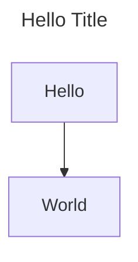
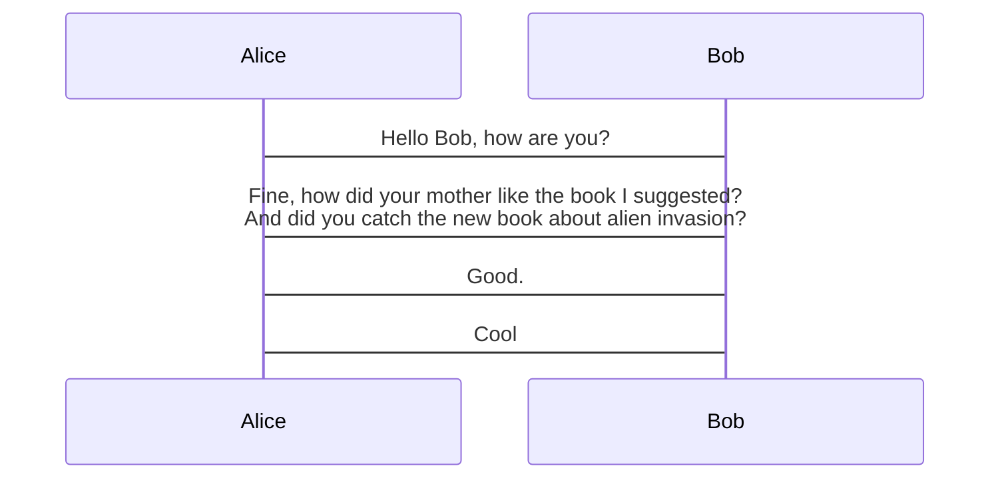
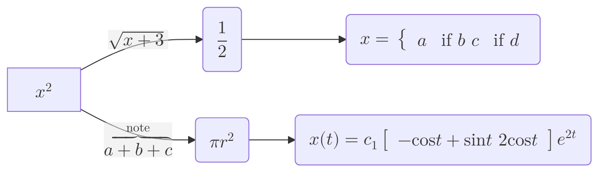

# Mermaid Usage

## Overview

1. Understand requirements, context, and define didactic strategy
2. Choose proper and most fitting type of diagram accordingly
3. Review, possibly reiterating
   - If environment/project has renderer configured, use it for
   visualizing as an image, putting it to scrutiny

## Diagram Types

*(Some of the linked reference files may only have short info about
the corresponding topic, and may contain `text` blocks containing one
or more examples. This was done for brevity, so examples speak for
themselves)*

Processes and relationships:

- [Flowchart](./t-flowchart.md) - processes/decisions/steps
- [State](./t-state.md) - state machines, transitions
- [Architecture](./t-architecture.md) - for services/resources
- [Mindmap](./t-mindmap.md) - graph-structured knowledge
- [ER](./t-entity-relationship.md) - DB-like entities
- [Venn](./t-venn.md) - Venn diagrams
- [Ishikawa/Herringbone/Cause-and-effect](./t-ishikawa.md) -
  hypothetical/actual causes of problem/event

Progressions of events:

- [Timeline](./t-timeline.md) - timeline of events
- [Gantt](./t-gantt.md) - timeline that allows for time-ranges
- [Sequence](./t-sequence.md) - interactions/APIs/messaging,
  back-and-forth "timeline" of events (without focusing necessarily on
  time)

Quantitative:

- [Pie](./t-pie.md) - proportions/distributions
- [XY](./t-xy.md) - line/bar charts
- [Radar](./t-radar.md) - multi-dimensional comparisons
- [Quadrant](./t-quadrant.md) - four-quadrant analysis
- [Sankey](./t-sankey.md) - flows of sets of values

Scenario-specific:

- [Git](./t-git.md) - branches/merges/etc
- [Packet](./t-packet.md) - network packets
- [Railroad](./t-railroad.md) - simple and complex context-free
  grammars, syntax specifications

## Common Settings and Tricks

### Setting title

### Wrapping with maximum width

### Using Latex via `$$`

