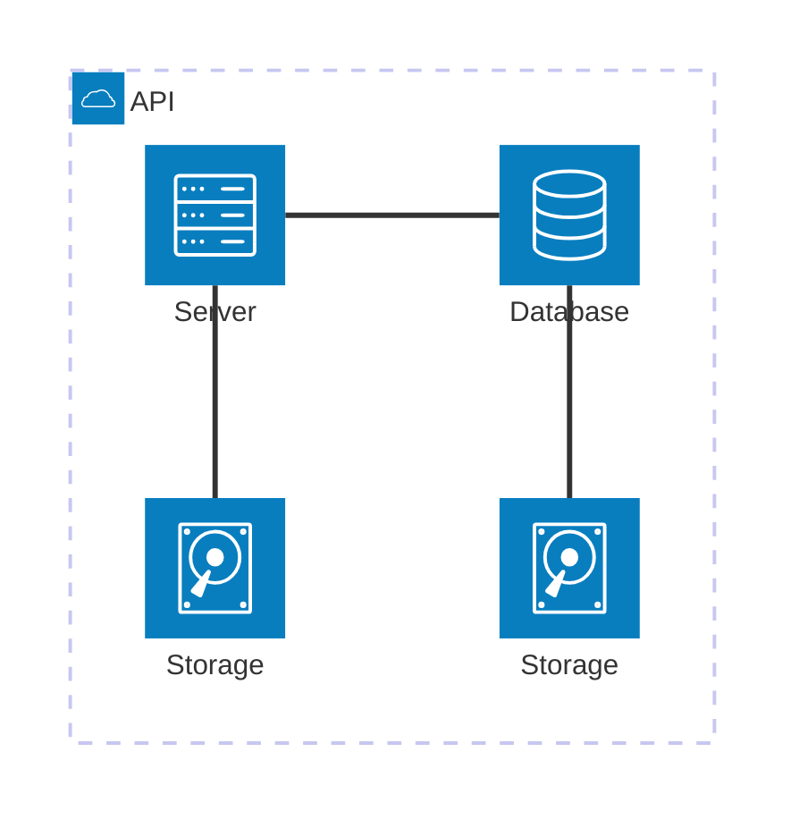
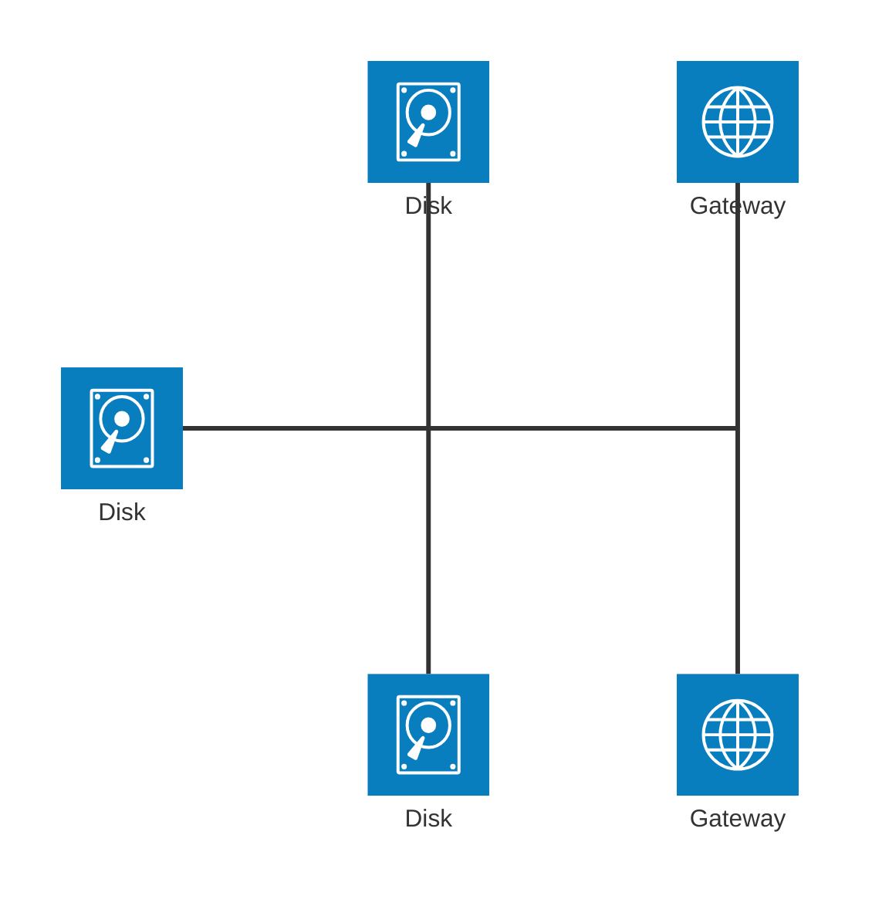

# Architecture Diagram

**Minimum version is v11.1.0!**

```mermaid
architecture-beta
    group api(cloud)[API]

    service db(database)[Database] in api
    service disk1(disk)[Storage] in api
    service disk2(disk)[Storage] in api
    service server(server)[Server] in api

    db:L -- R:server
    disk1:T -- B:server
    disk2:T -- B:db
```

```mermaid
architecture-beta
    group sources(cloud)[Sources]
        service src_a(server)[Source A] in sources
        service src_b(server)[Source B] in sources
        service src_c(server)[Source C] in sources

    group storage(database)[Storage]
        service db_one(database)[DB One] in storage
        service db_two(database)[DB Two] in storage
        service db_three(database)[DB Three] in storage

    group output(disk)[Output]
        service brief(disk)[Brief] in output
        service analyst(server)[Analyst] in output
        service delivery(cloud)[Delivery] in output

    src_a:B --> T:db_one
    src_b:B --> T:db_two
    src_c:B --> T:db_three
    db_two:B --> T:brief
    brief:R --> L:analyst
    analyst:R --> L:delivery

    align row src_a src_b src_c
    align row db_one db_two db_three
    align row brief analyst delivery

    align column src_a db_one
    align column src_b db_two brief
    align column src_c db_three
```

```mermaid
architecture-beta
    service left_disk(disk)[Disk]
    service top_disk(disk)[Disk]
    service bottom_disk(disk)[Disk]
    service top_gateway(internet)[Gateway]
    service bottom_gateway(internet)[Gateway]
    junction junctionCenter
    junction junctionRight

    left_disk:R -- L:junctionCenter
    top_disk:B -- T:junctionCenter
    bottom_disk:T -- B:junctionCenter
    junctionCenter:R -- L:junctionRight
    top_gateway:B -- T:junctionRight
    bottom_gateway:T -- B:junctionRight
```
