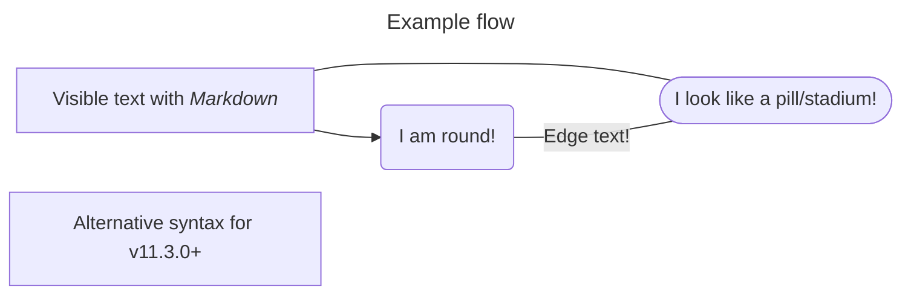

# Flowchart



- **Objects**
  - are nodes and edges (directed or not)
  - have text (if omitted, object name is used) with `[]`
  - as in example, text renders as markdown when `[]` has contents
    wrapped in quotes wrapped in backticks
- **Nodes**
  - **Shapes:** (shape code for alt. syntax is wrapped in backticks)
    - `[]` - square
    - `()` - round
    - `([])` - pill/stadium-shaped
    - `[[]]` - subroutine shape
    - `[()]` - cylindrical
    - `(())`, `((()))` - circle
    - `>]` - assymetric, `>` makes left-side angled-in, `]` makes
      right-side flat as usual - the other symbols can be used for the
      assymetric style
    - `{}` - node/rhombus
    - `{{}}` - hexagon
    - `[//]` or `[\\]`, `[/\]` or `[\/]` - parallelograms and
      trapezoids
- **Edges**
  - **Types:**
    - `-->` - straight w. arrow head
    - ` --- ` - open link
    - `-.->` - dotted arrow
    - `==>` - thick arrow
    - `--o` - circle
    - `--x` - cross
    - `<-->` - multi-directional
    - `~~~` - invisible - may be useful for altering node positioning
  - **Chaining of links:**
    - `A -->|text|B --- C`
    - `A --> b & c --> d`
  - **Dependencies:**
    - `A & B--> C & D` is short-form of:

      ```text
      A --> C
      A --> D
      B --> C
      B --> D

      ```

  - **Edge IDs:** `A e1@--> B`
  - **Animation:**
    - `e1@{ animate: true }`
  - **Ranks:**
    - Ranks determinte relative length of edges
    - Make a link outrank others by increasing number of dashes (or
      whatever the intermediary symbol is)
- **Subgraphs:**

  ```mermaid
  flowchart TB
      c1-->a2
      subgraph one
      a1-->a2
      end
      subgraph two
      b1-->b2
      end
      subgraph three
      c1-->c2
      end
  ```

  ```mermaid
  flowchart TB
      c1-->a2
      subgraph one
      a1-->a2
      end
      subgraph two
      b1-->b2
      end
      subgraph three
      c1-->c2
      end
      one --> two
      three --> two
      two --> c2
  ```
