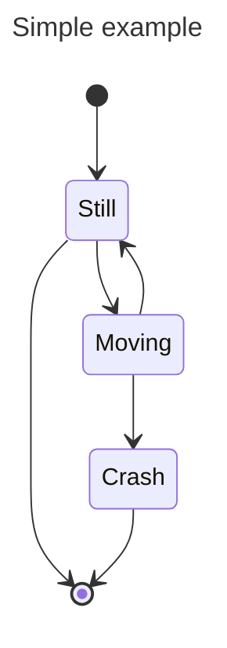
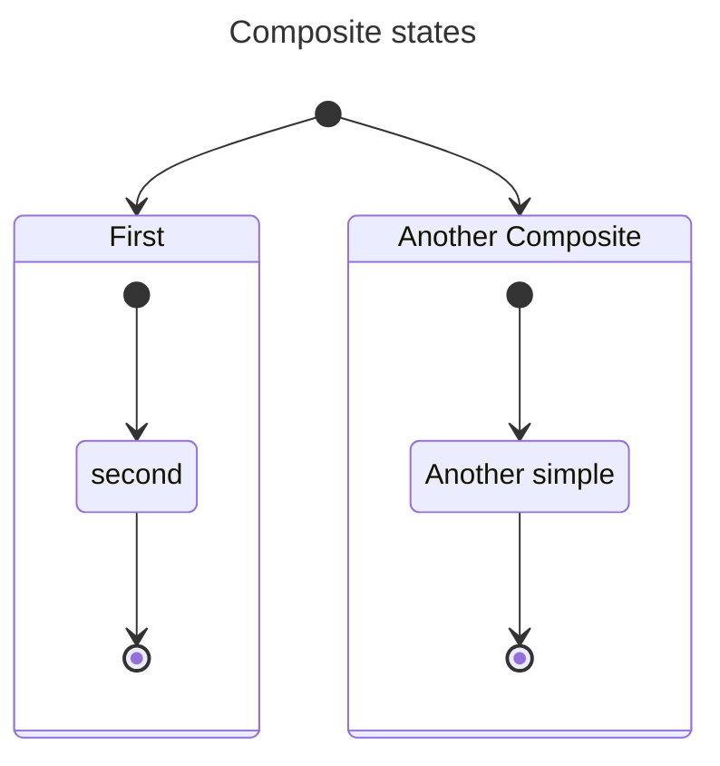
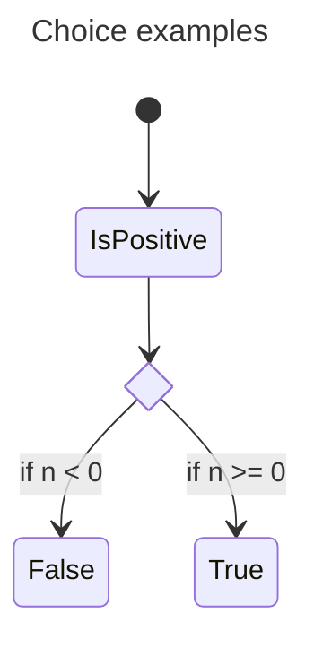
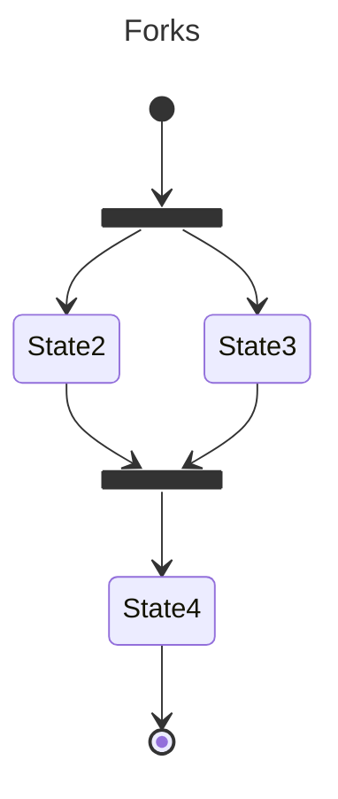
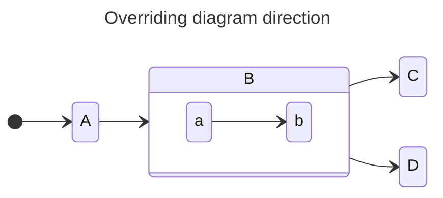

# State Diagrams

```mermaid
---
title: Simple example
---
stateDiagram-v2
  [*] --> Still
  Still --> [*]

  Still --> Moving
  Moving --> Still
  Moving --> Crash
  Crash --> [*]
```

```mermaid
---
title: Composite states
---
stateDiagram-v2
  [*] --> First
  state First {
    [*] --> second
    second --> [*]
  }

  [*] --> NamedComposite
  NamedComposite: Another Composite
  state NamedComposite {
    [*] --> namedSimple
    namedSimple --> [*]
    namedSimple: Another simple
  }
```

```mermaid
---
title: Choice examples
---
stateDiagram-v2
  state if_state <<choice>>
  [*] --> IsPositive
  IsPositive --> if_state
  if_state --> False: if n < 0
  if_state --> True : if n >= 0
```

```mermaid
---
title: Forks
---
stateDiagram-v2
 state fork_state <<fork>>
   [*] --> fork_state
   fork_state --> State2
   fork_state --> State3

   state join_state <<join>>
   State2 --> join_state
   State3 --> join_state
   join_state --> State4
   State4 --> [*]
```

```mermaid
---
title: Overriding diagram direction
---
stateDiagram
 direction LR
 [*] --> A
 A --> B
 B --> C
 state B {
   direction LR
   a --> b
 }
 B --> D
```
